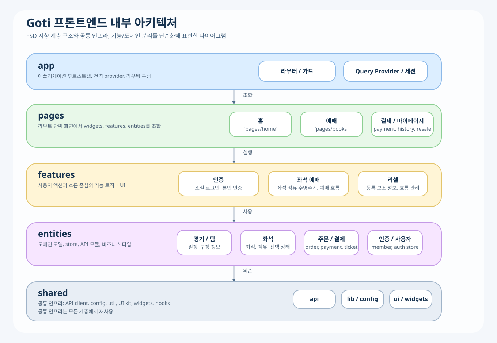

# Goti Frontend

<table align="center">
  <tr>
    <td bgcolor="#FFFFFF" style="border-radius: 16px; padding: 18px 28px;">
      
    </td>
  </tr>
</table>

<p align="center">
  야구 경기 예매, 대기열, 좌석 선택, 결제, 리셀 흐름을 다루는 Goti 프론트엔드입니다.
</p>

<p align="center">
  
</p>

## Overview

- React 19 + TypeScript + Rsbuild 기반의 웹 애플리케이션입니다.
- FSD 지향 구조로 `app / pages / features / entities / shared` 계층을 분리합니다.
- 예매 진입부터 대기열, 좌석 선택, 결제, 마이페이지, 리셀까지 사용자 흐름을 다룹니다.

## Features

<table>
  <tr>
    <td width="33%">
      <strong>대기열 / 예매 진입</strong><br />
      경기 예매 시작 시 대기열에 진입하고, 순번 상태를 확인한 뒤 안전하게 좌석 선택 단계로 이동합니다.
    </td>
    <td width="33%">
      <strong>좌석 선택 / 점유</strong><br />
      좌석 배치도 탐색, 좌석 선택, 점유 상태 관리, 예매 진행 흐름을 프론트에서 제어합니다.
    </td>
    <td width="33%">
      <strong>결제 / 주문 처리</strong><br />
      일반 예매와 리셀 결제 흐름을 분리해 주문 요약, 결제 수단, 결제 완료 상태를 관리합니다.
    </td>
  </tr>
  <tr>
    <td width="33%">
      <strong>로그인 / 인증</strong><br />
      카카오, 네이버, 구글 기반 소셜 로그인과 본인 인증, 세션 상태 처리를 지원합니다.
    </td>
    <td width="33%">
      <strong>마이페이지</strong><br />
      구매 내역, 상세 티켓 정보, 계정 정보, 판매 등록 상태 등 사용자 개인화 화면을 제공합니다.
    </td>
    <td width="33%">
      <strong>리셀 / 재판매 흐름</strong><br />
      리셀 등록, 가격/상태 확인, 리셀 결제, 판매 내역 관리까지 이어지는 흐름을 다룹니다.
    </td>
  </tr>
</table>

주요 사용자 흐름은 `홈 → 경기 선택 → 대기열 → 좌석 선택 → 결제 → 마이페이지 / 리셀` 구조로 연결됩니다.

## Tech Stack

- `React 19`
- `TypeScript`
- `Rsbuild / Rspack`
- `Tailwind CSS v4`
- `TanStack Query`
- `Zustand`
- `React Hook Form + Zod`
- `Axios`
- `MSW`

## Quick Start

```bash
npm install
npm run dev
```

기본 개발 서버는 `http://localhost:3000` 에서 확인할 수 있습니다.

## Scripts

```bash
npm run dev      # 개발 서버 실행
npm run build    # 프로덕션 빌드
npm run preview  # 빌드 결과 미리보기
```

## Project Structure

```text
src
├── app        # 앱 부트스트랩, 전역 provider, 라우터
├── pages      # 라우트 단위 화면 조합
├── features   # 사용자 액션 중심 기능
├── entities   # 도메인 모델, store, API
├── shared     # 공통 UI, API client, config, util
└── styles     # 전역 스타일
```

주요 페이지/도메인 예시는 다음과 같습니다.

- `src/pages/home`: 홈 화면
- `src/pages/books`: 예매 진입, 좌석 선택
- `src/pages/queue`: 대기열 화면
- `src/pages/tickets`: 결제 및 티켓 흐름
- `src/pages/mypage`: 구매 내역, 계정, 리셀 관리
- `src/features/auth`: 소셜 로그인 및 인증 플로우
- `src/features/seat-booking`: 좌석 점유/예매 플로우 제어
- `src/entities/*`: 경기, 팀, 좌석, 주문, 결제, 사용자 등 도메인 단위 모듈

## Architecture

아키텍처 다이어그램은 [frontend-architecture-ko.svg](./frontend-architecture-ko.svg) 에 정리되어 있습니다.

- `app` 은 라우터, 세션, Query Provider 같은 앱 수준 구성을 담당합니다.
- `pages` 는 화면 단위에서 `features`, `entities`, `shared` 를 조합합니다.
- `features` 는 로그인, 예매, 리셀처럼 사용자 액션 중심 로직을 포함합니다.
- `entities` 는 게임, 좌석, 주문, 결제 같은 도메인 상태와 API를 관리합니다.
- `shared` 는 공통 UI 컴포넌트, API client, config, util을 제공합니다.

## Contributors

최근 커밋 기록 기준으로 정리했습니다.
기준 기간: `2026-04-01` 이후

| 기여자 | 담당 파트 |
| --- | --- |
| `kimsuhyeon` | 예매/대기열/좌석 흐름, 리셀 예매 경로, 결제 API 연동, 마이페이지 및 리셀 구매 이력, 공통 API 클라이언트, 배포/보안 설정, 저장소 통합 작업 |
| `yebyn` | 마이페이지 API 연결 및 오류 수정, 티켓/결제 연계 보정, 홈 일정/티켓 화면 버그 수정 |
| `yebyn98` | 마이페이지 관련 브랜치 병합, `develop` 동기화, 통합 작업 지원 |
| `ressKim` | OAuth 설정 보정, 프로덕션 환경변수/배포 설정, 보안 관련 설정 정리 |
| `xaczxzz` | 매크로 대시보드 초기 추가, 마우스 트래킹 실험 및 관련 화면 연동 |

## Development Notes

- API 연결 작업 시 UI 변경은 분리하는 것이 원칙입니다.
- 내부 호출용 API는 프론트엔드에서 직접 사용하지 않습니다.
- 공통 컴포넌트를 수정할 때는 기존 디자인 시스템과 `src/styles/globals.css` 를 기준으로 맞춥니다.
- 테스트/모킹 관련 코드는 `src/shared/api/mocks` 와 `public/mockServiceWorker.js` 를 사용합니다.

## Build

```bash
npm run build
npm run preview
```

## Reference

- Rsbuild Docs: https://rsbuild.rs
- Rspack Docs: https://rspack.rs
